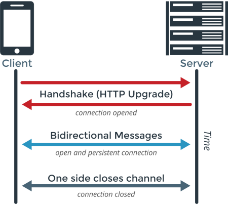

# Middleware

Websockets in general follow a different lifecycle then HTTP requests.



This means websockets in Django do not have a pre-established middleware mechanism. However, middleware is still helpful with websockets. Because websockets and GraphQL requests have a more complex lifecycle there are several different middleware mechanisms available. This document outlines all the options you have for doing middleware with Graphene GraphQL requests and websockets.

## Graphene Middleware

This middlware comes built into Graphene and can help you modify GraphQL requests that are both synchronous (queries and mutations) and asynchronous (subscriptions). This mechanism is not new to Luna, but is just here as a reminder since this mechanism works throughout all GraphQL requests. This allows you to create one middleware instead of having two different methods. So if you can use this middleware, it should be your first choice.

See the [Graphene middleware docs](https://docs.graphene-python.org/en/latest/execution/middleware/).

In Django you can set the middleware with the `GRAPHENE` setting.

```python
GRAPHENE = {
    ...
    'MIDDLEWARE': ['myproject.middleware.GraphQLMiddleware'],
}

```

## Websocket Middleware

The websocket middleware functions much like the standard Django request/response middleware; however, since websockets open a long lived connection and message are received and sent asynchronously it works slightly different.

This middleware is good for authenticating the initial websocket connection, performing setup and tear down, modifying the send and receive functions.

Websocket middleware setup in `settings.py`:

```python
GRAPHQL_WS_MIDDLEWARE = [
    'myproject.middleware.AuthAsyncMiddleware',
]
```

Example middleware:

```python
from importlib import import_module

from asgiref.sync import sync_to_async

from django.contrib import auth
from django.conf import settings


class AuthAsyncMiddleware:
    def __init__(self, func):
        self.func = func

    async def __call__(self, ws, receive, send):
        if not hasattr(ws.request, 'user'):
            engine = import_module(settings.SESSION_ENGINE)
            SessionStore = engine.SessionStore
            session_key = ws.request.COOKIES.get(settings.SESSION_COOKIE_NAME)
            ws.request.session = SessionStore(session_key)
            ws.request.user = await sync_to_async(auth.get_user)(ws.request)

        return await self.func(ws, receive, send)
```
